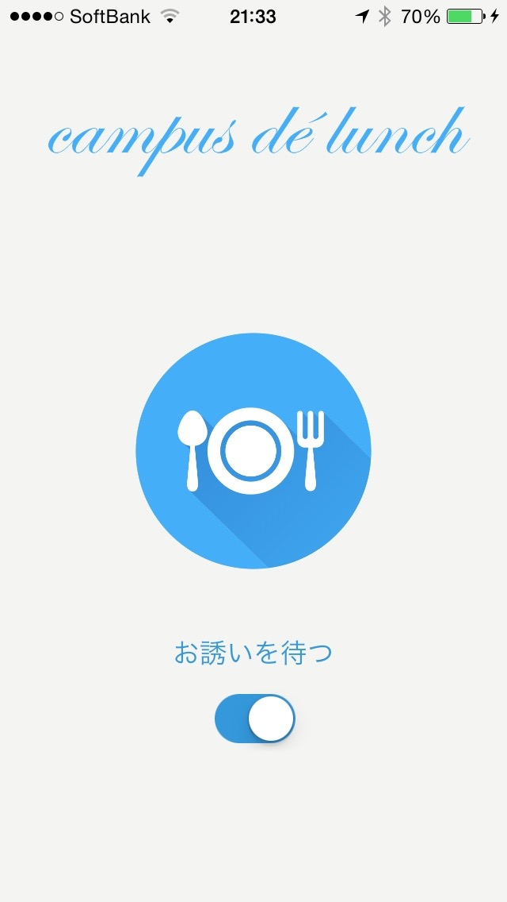
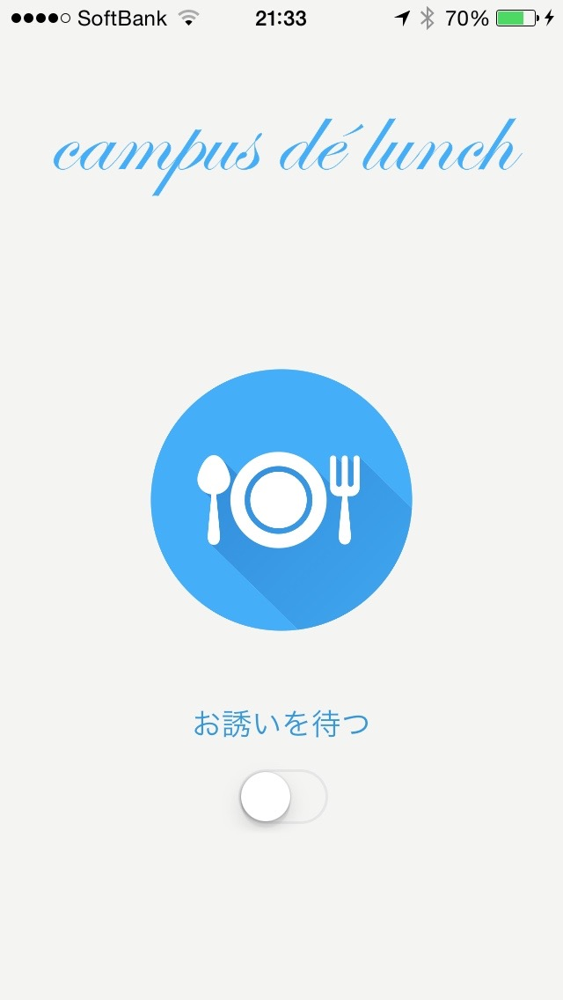
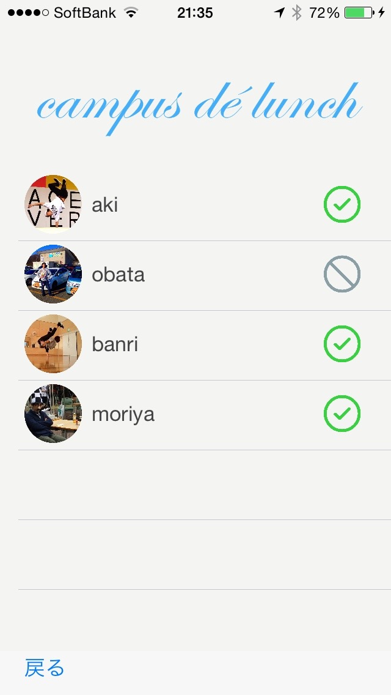

<!-- # tance -->
### メンバー
* 小寺 暁久
* 早川 悠
* 小幡 潤
* 森谷 優大
* 中村 万里

### 期間
* スタンダードコース(二週間)

## プロジェクト
### プロダクト名
#### campus de lunch

### 概要
* 大学でご飯を食べようと思った際に，友人が構内にいるかを確認しご飯に誘うことができるサービス
* 友人は自分で構内にいるかどうかのレスポンスをする必要がなく，アプリがバックグラウンドで'特定の場所にいるかいないか'の情報のみを返す．

### エレベーターピッチ
* [メシ友が学校にいるかいないか分からない件]を解決したい
* [一人でご飯を食べるのが寂しい人]向けの
* [お昼の楽しいひと時]を実現する
* [campus de lunch]です．
* これは[大学ですぐにご飯のお誘い]ができ，
* [LINEやSMS]とは違って
* [即時的な場所の把握ができる機能]が備わっています.

### システム構成
* サーバ(IDCFクラウド)
* iOS端末
* Android端末

### 動作の流れ
1. ユーザの端末は，以下の2つのステータスを保持する
  * 大学構内にいるか
  * 食事に誘われたら行くか
2. ユーザは事前にアプリにて，"食事に誘われたら行くか"を選択しておく
3. ユーザAがアプリ内にて，食事に誘うボタンをタッチすると，サーバにユーザAが誘っているという情報が送られる
4. サーバは，ユーザB,C,D...に対して，サイレント通知にて状態を返すように依頼する
5. ユーザB,C,D...の端末は，バックグラウンドにて自分のステータスに応じて，食事に行くor行かないをサーバに通知する
6. サーバはユーザB,C,D...から通知を受け取ると，ユーザAに対して，ユーザと行くかどうかの情報を送る．
7. ユーザAの端末に，他のユーザの状態が表示される

### Home画面 - お誘いを待っている状態

### Home画面 - お誘いを待っていない状態

### List画面 - 友人の状態が一覧表示される

